# 👨‍💻 Portfolio: Developments and Projects

Welcome to my portfolio! Here you'll find a curated list of my personal, academic, and community-driven projects, covering a range of topics from game modding to web development and desktop applications.

## 🐎 Console App: Studbook Scraper & Race Estimator (Python, Selenium)
**Freelance / Academic project.**  
A Python-based script developed for collecting and analyzing horse racing data, designed to assist users in making informed betting decisions before a race event. It scrapes online data, processes it into structured reports, and highlights key statistics for each horse.

**Project overview:**
- Originally developed as a freelance tool for bettors, automating the collection of race and horse data from dynamic websites using Selenium and Playwright.
- Processes and structures data with pandas, storing it in a normalized SQLite3 database.
- Generates daily reports with calculated variables and race-by-race recommendations.

**Current evolution:**
- The project is now evolving into a more advanced data analysis tool:
  - Refactoring to support asynchronous scraping using `asyncio`.
  - Expanding the number of variables analyzed for better prediction quality.
  - Improving code structure to support experimentation with predictive algorithms.

**Academic collaboration:**  
This tool is also part of a joint research initiative in collaboration with a professional statistician. A poster presentation on the algorithmic logic will be featured at the *LI Coloquio Argentino de Estadística* in Tucumán later this year.

**Screenshots:**

  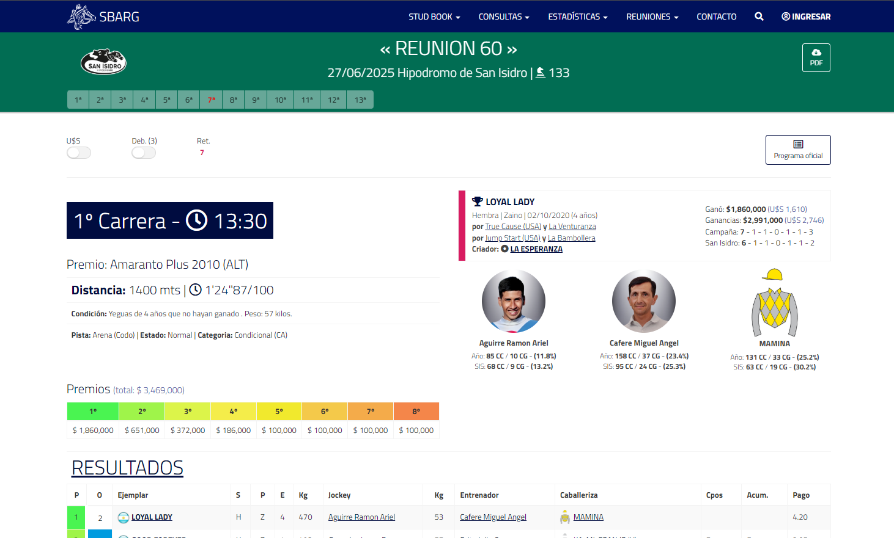
  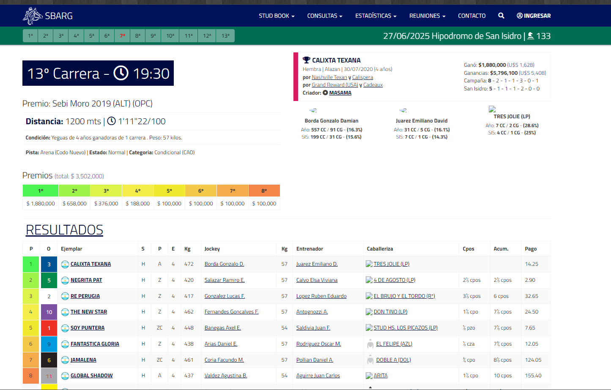
  
  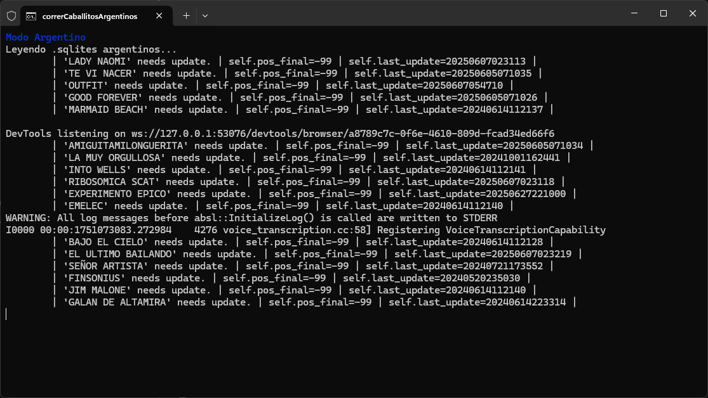
  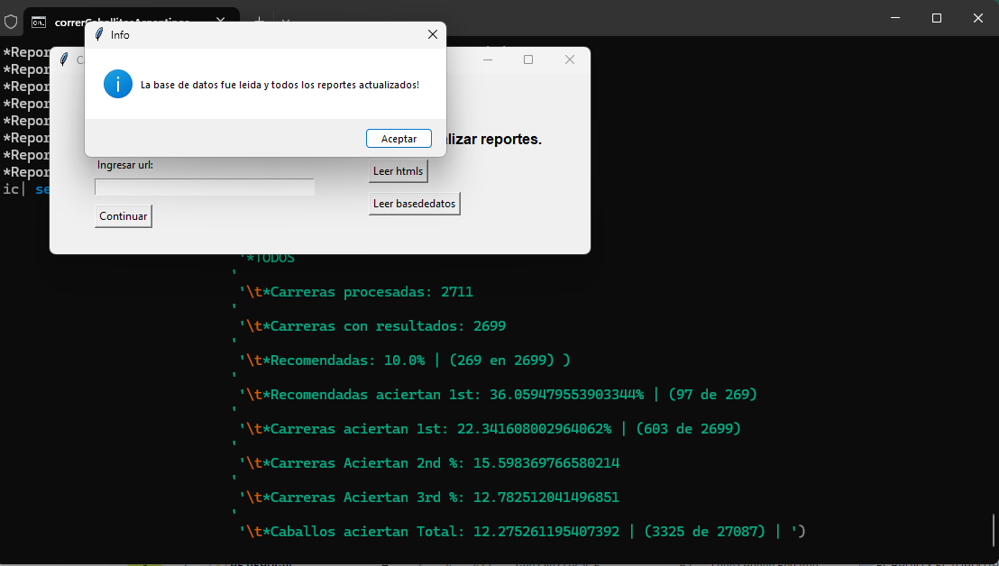
  
  

---

## 🧙 Desktop App: BFME2 Patch Switcher (Python, PyQt6)
**Community / Hobby project.**  
A practical PyQt6-based GUI tool for managing patch versions, mods, and utilities for *The Lord of the Rings: The Battle for Middle-Earth II*. Designed to help organize and update an abandonware community.

**Key features:**
- GUI patch switcher and updater for BFME2, distributed to players since 2023.
- Connects to a remote JSON file to fetch patch updates, utilities, and installers.
- Fully self-contained desktop app with binary distribution.

**Screenshots:**

  
  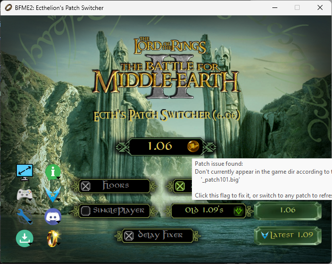
  
  
  
  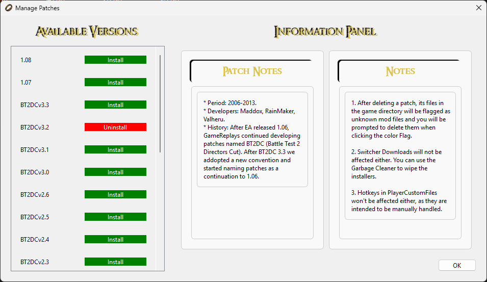

---

## 🏥 [Desktop App: Medic Clinic Turn Manager (C#, WPF)](https://github.com/alexander5109/ClinicaMedicaGestorDeTurnos-WPF)
**Academic project.**  
A desktop application built with **WPF and .NET 8.0** for managing medical appointments in a clinical setting. Designed as a hands-on project for the *"Programación II"* course at the *Tecnicatura Universitaria en Programación* (UTN, 2024).

**Key features:**
- Modern UI with custom-styled buttons and dynamic view switching.
- Supports both **JSON** and **SQL Server** as persistence backends.
- Binds logic directly to UI components, avoiding MVVM for simplicity.
- Fully functional CRUD system with separated modules for patients, doctors, and appointment scheduling.

**Screenshots:**

  
  
  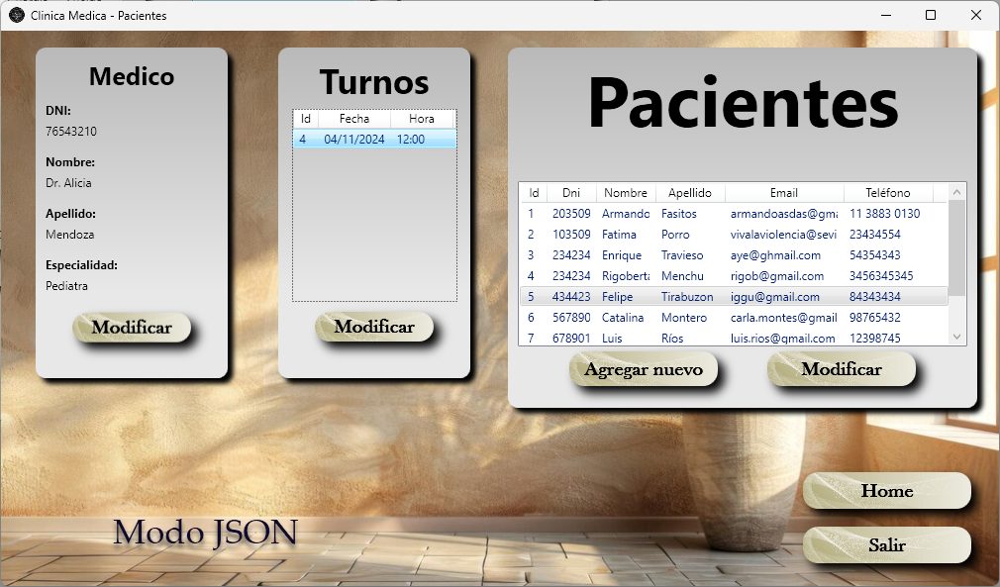
  
  
  
  

---

## 🏫 [Website with BackEnd: Vocational Training XXI (Python, Django)](https://github.com/alexander5109/FormacionLaboralXXI-DjangoWebApp)
**Academic project.**  
A Django-based web application simulating a vocational training management system. It models students, institutions, courses, and training centers using a normalized relational schema. Developed in **2023** during the *Programmer course* at *Centro de Formación Profesional N.º 406 (Morón, Argentina)*.

> ⚠️ **Note:** This is a learning project, not intended for real-world deployment. All authenticated users can edit data (students, institutions, courses) to explore Django’s ORM and architecture. Deletions are restricted to preserve data during testing.

**Features:**
- Models: `Estudiante`, `Curso`, `Institucion`, `Provincia`, `FamiliaProfesional`, and more.
- Hierarchical + many-to-many relationships.
- Auto-generated slugs and timestamped records.
- Django admin panel and basic login system.
- Optional avatars and feedback form (`Queja`).
- SQLite + Bootstrap template for frontend visualization.

**Screenshots:**

  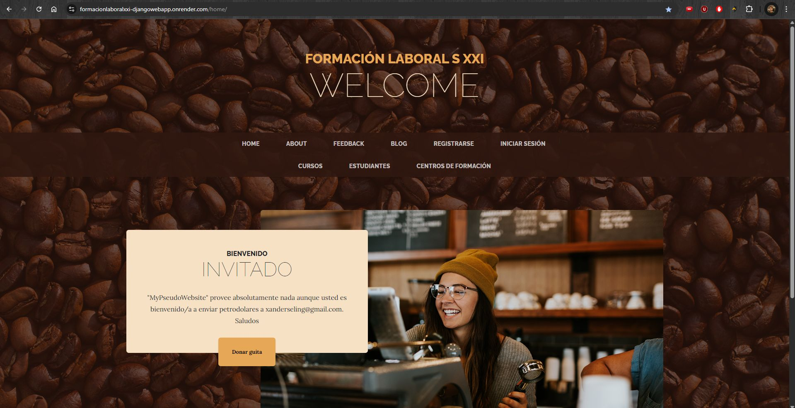
  
  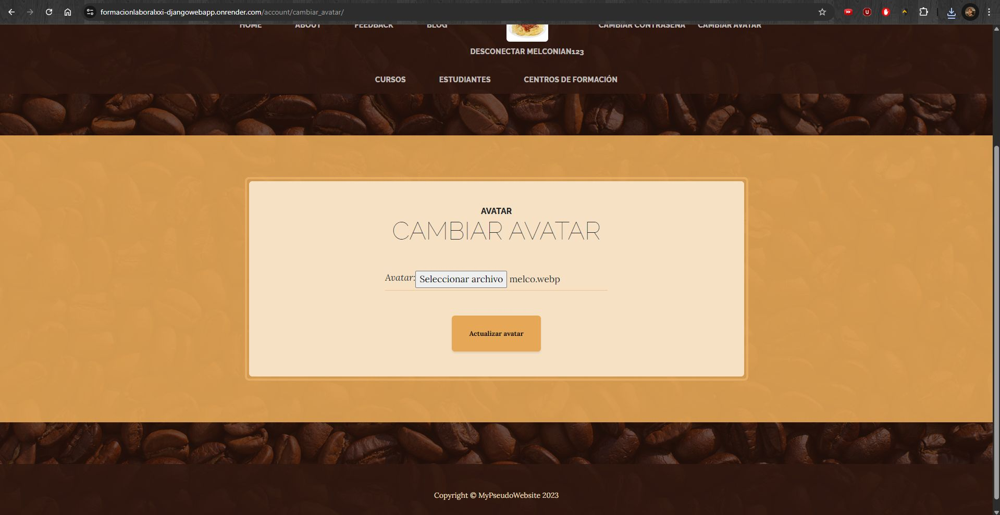
  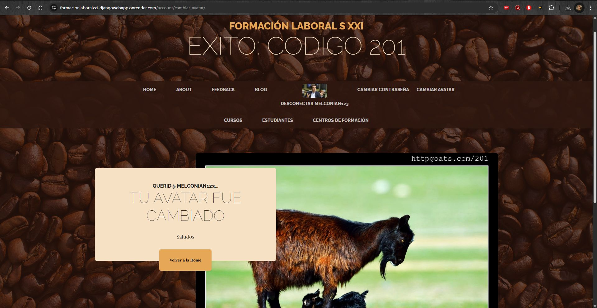
  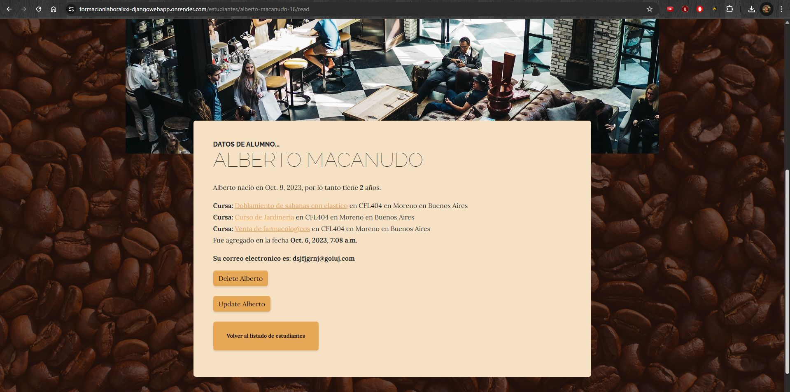
  
  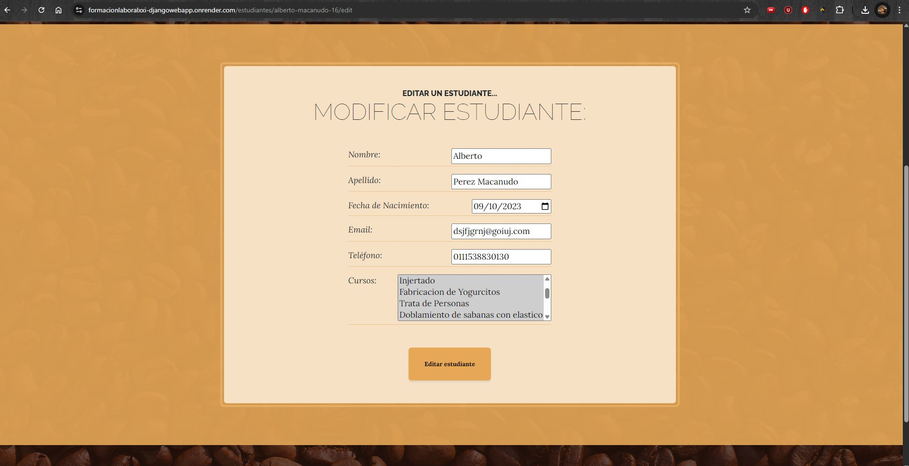
  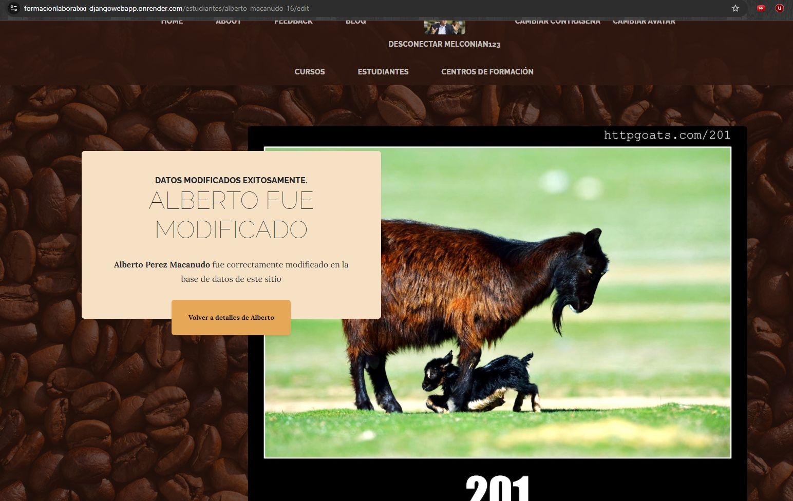

---

## 🛒 [Web Page FrontEnd: E-commerce prototype: Courses academy (HTML, CSS, JS)](https://github.com/alexander5109/CursosStore-FrontendJS)
**Academic project.**  
A simple frontend-only e-commerce prototype built with HTML, CSS, and JavaScript. It consumes public API data to simulate a course catalog with cart functionality. Developed in 2024 as part of the *TalentoTech Frontend* course.

**Features:**
- Product listing from API.
- Shopping cart using `localStorage`.
- Mobile-friendly UI with vanilla JS logic.

**Screenshots:**

  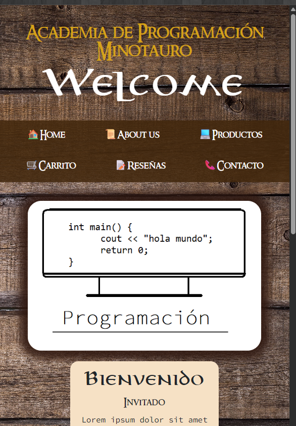
  
  

---

## 🎮 [Console App: BFME2 Top 10 Best Players: Challenge System (Python) ](https://github.com/alexander5109/BFME2-ChallengeSystemTop10Players)
**Community / Hobby project.**  
A challenge tracking system designed for the *BFME2* multiplayer community. It maintains historical data in CSV format, stores player rankings in JSON, and publishes reports on a Discord channel. Originally architected for Discord bot integration, it currently runs manually.  
Developed in 2022 and continuously maintained, I actively incorporate user feedback to add features, fix bugs, and optimize performance.

**Screenshots:**

  
  
  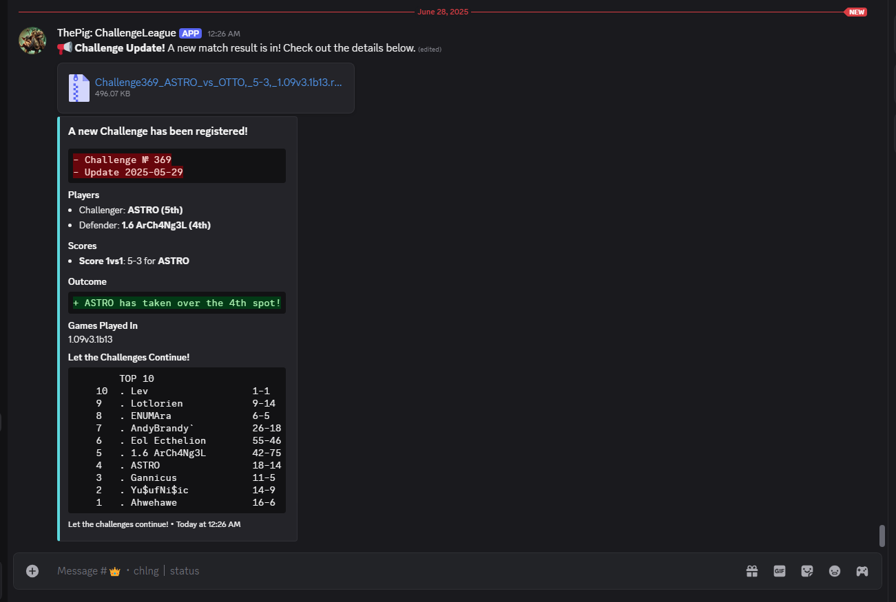

---

## 🧩 [BFME2 Patch: The Lord of The Rings: Battle for Middle-earth II – GameReplays.org Patch Development](https://github.com/ValheruGR/BFME2)  
**Community project / hobby.**  
I have been actively involved in maintaining, testing, and developing patches for *BFME2* under the SAGE engine, collaborating with the international community to keep this classic game alive and competitive. My role evolved from tester to co-developer, and eventually to lead technical maintainer and section admin for BFME2 on GameReplays.org.

**Roles and responsibilities:**  
- Co-developer of patches 1.09 and 1.09v2 (approximately 100 beta versions combined).  
- Lead developer of patch 1.09v3.0 (65 beta versions).  
- Tester for earlier versions (1.07 and 1.08), contributing to balance, QA, and bug reporting.  
- Author of a Python GUI-based *Patch Switcher*, enabling users to switch between versions without modifying the binary files.  
- Maintained complex `.ini` configuration files under strict engine constraints (no `.exe` modification), similar to working with embedded DSLs.  
- Coordinated community efforts for competitive balance, map design, and ongoing user feedback.

**What I learned:**  
- **Technical English and international communication:** over a decade of forum discussions, chat-based coordination, and community support for an unsupported legacy game.  
- **Version control:** extensive use of tools like **WinMerge** and **TortoiseGit** to compare builds, manage changes, and perform safe merges.  
- **Advanced debugging:** binary search between builds to locate runtime bugs in the absence of error logs or stack traces.  
- **QA and support:** solving bugs reported by users, writing documentation, handling regressions, and managing volunteer testers.

**Featured release:**  
> “After a long journey of testing with over 65 beta versions, we are excited to share the highly anticipated Patch 1.09 Version 3.0”  
> 👉 [Read the official announcement on GameReplays.org](https://www.gamereplays.org/battleformiddleearth2/portals.php?show=page&name=bfme2-patch-1.09-version-3.0-live)

**Screenshots:**  

  

---

## 🎮 [BFME2 Custom Map: Bos Primigenius Taurus: The Tower War)](https://github.com/alexander5109/BFME2-BosPrimigeniusTaurusTheTW)
**Community / Hobby project.**  
A fully custom *Tower War* map for *BFME2*, fundamentally reworking core gameplay through scripting. This project served as my introduction to game modding and programming logic. Developed and distributed between 2018 and 2023, it has been actively maintained since then.  
Players regularly send feedback via email, which I carefully review to implement updates and improvements, keeping the experience fresh and balanced.

**Screenshots:**

  
  
  

---

## 📫 Contact

- 📧 Email: [xanderseling@gmail.com](mailto:xanderseling@gmail.com)  
- 🔗 LinkedIn: [linkedin.com/in/alexander5109](https://www.linkedin.com/in/alexander5109/)
